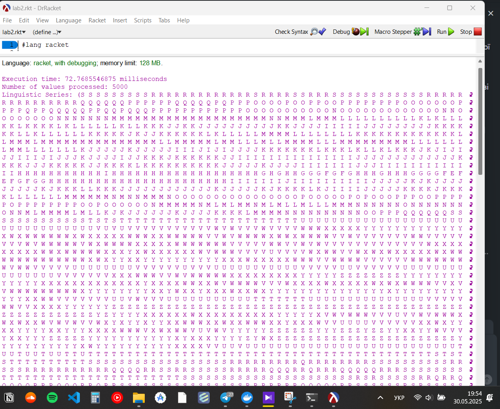
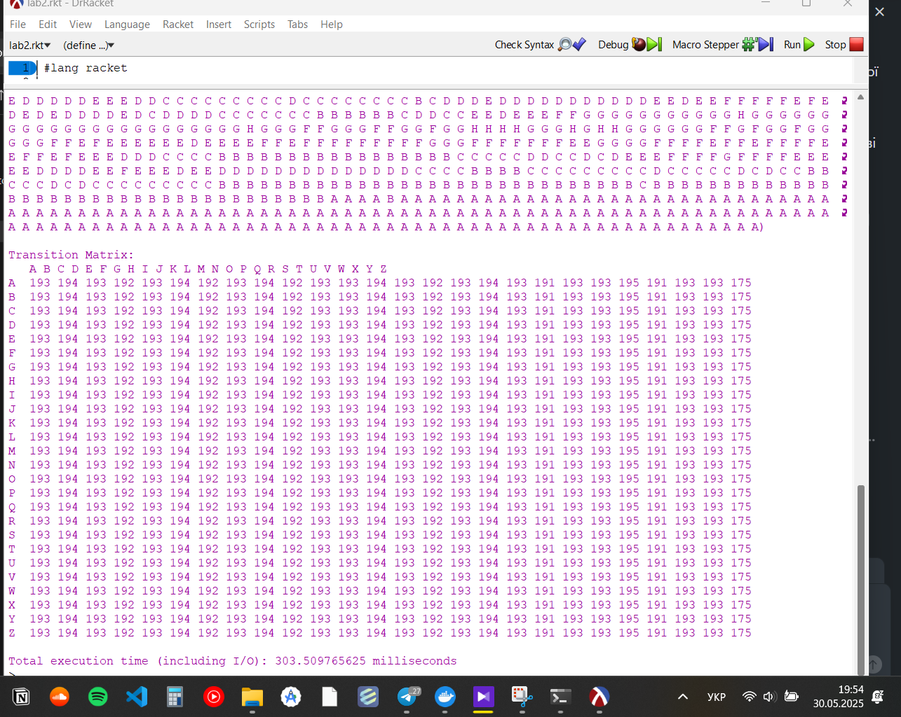

# Лабораторна робота №2
## Перетворення числового ряду в лінгвістичний ланцюжок

### Встановлення та запуск

1. Встановлення Racket:
   - Завантажте Racket з офіційного сайту: https://download.racket-lang.org/
   - Встановіть програму, дотримуючись інструкцій встановлення

2. Встановлення необхідних пакетів:
   - Відкрийте командний рядок (Command Prompt або PowerShell)
   - Виконайте команду:
     ```
     raco pkg install csv-reading
     ```

3. Запуск програми:
   - Відкрийте DrRacket
   - Відкрийте файл `lab2.rkt`
   - Переконайтеся, що файл з даними `B-C-D-E-F-Brent Oil Futures Historical Data.csv` знаходиться в тій самій папці, що й `lab2.rkt`
   - Натисніть кнопку "Run" або використайте комбінацію клавіш Ctrl+R

Альтернативний спосіб запуску через командний рядок:
```
racket lab2.rkt
```

### 1. Постановка завдання

Розробити програму на функціональній мові програмування (Racket), яка виконує наступні завдання:

1. Зчитування числового ряду з CSV файлу
2. Сортування числового ряду
3. Створення інтервалів на основі дискретного рівномірного розподілу
4. Перетворення числових значень у лінгвістичні символи
5. Побудова матриці переходів між символами

### 2. Розв'язання задачі

#### Функціональна схема

```
main
├── process-time-series
│   ├── read-price-data
│   │   └── sanitize-price-str
│   ├── sort-series
│   ├── create-intervals
│   ├── convert-to-linguistic
│   │   └── number-to-symbol
│   └── build-transition-matrix
└── print-transition-matrix
```

#### Бібліотека функцій

1. `read-price-data` - зчитує дані з CSV файлу
2. `sanitize-price-str` - очищає рядок від зайвих символів
3. `sort-series` - сортує числовий ряд
4. `create-intervals` - створює інтервали на основі обраного розподілу
5. `number-to-symbol` - перетворює число в лінгвістичний символ
6. `convert-to-linguistic` - перетворює числовий ряд в лінгвістичний
7. `build-transition-matrix` - будує матрицю переходів
8. `print-transition-matrix` - виводить матрицю переходів
9. `process-time-series` - головна функція обробки даних
10. `main` - точка входу в програму

### 3. Результати розрахунку

#### Час виконання
- Час обробки даних: 72.77 мс
- Загальний час виконання (включаючи I/O): 303.51 мс

#### Результати обробки
- Кількість оброблених значень: 5000
- Розмір алфавіту: 26 символів (A-Z)
- Тип розподілу: дискретний рівномірний

#### Скріншоти виконання




### 4. Лістінг програми

```racket
#lang racket

(require csv-reading)

;; Constants
(define MAX-ALPHABET-SIZE 26)

;; Structure to hold interval information
(struct interval (start end symbol))

;; Distribution types
(define UNIFORM-DISTRIBUTION 'uniform)
(define DISCRETE-UNIFORM-DISTRIBUTION 'discrete-uniform)

;; Function to read CSV file and extract price data
(define (read-price-data filename)
  (define rows (call-with-input-file filename
                 (lambda (port)
                   (csv->list port))))
  (define data (rest rows)) ; skip header
  (for/list ([row data]
             #:when (and (list? row) (>= (length row) 2)))
    (sanitize-price-str (list-ref row 1)))) ; column 1 = "Price"

(define (sanitize-price-str s)
  (string->number
   (regexp-replace* #px"[^0-9.]" s ""))) ; removes % and K if they sneak in

;; Function to sort numerical series
(define (sort-series numbers)
  (sort numbers <))

;; Function to create intervals based on distribution type
(define (create-intervals sorted-numbers alphabet-size distribution-type)
  (define min-val (first sorted-numbers))
  (define max-val (last sorted-numbers))
  (define range (- max-val min-val))
  
  (case distribution-type
    [(uniform)
     ;; Equal width intervals
     (define interval-width (/ range alphabet-size))
     (for/list ([i (in-range alphabet-size)])
       (define start (+ min-val (* i interval-width)))
       (define end (+ start interval-width))
       (define symbol (integer->char (+ (char->integer #\A) i)))
       (interval start end symbol))]
    
    [(discrete-uniform)
     ;; Equal probability intervals
     (define n (length sorted-numbers))
     (define elements-per-interval (ceiling (/ n alphabet-size)))
     
     (for/list ([i (in-range alphabet-size)])
       (define start-index (* i elements-per-interval))
       (define end-index (min (sub1 n) (+ start-index elements-per-interval -1)))
       (define start (list-ref sorted-numbers start-index))
       (define end (if (= i (sub1 alphabet-size))
                      max-val
                      (list-ref sorted-numbers end-index)))
       (define symbol (integer->char (+ (char->integer #\A) i)))
       (interval start end symbol))]
    
    [else (error "Unknown distribution type")]))

;; Function to convert number to linguistic symbol
(define (number-to-symbol number intervals)
  (define (find-interval num intervals)
    (cond
      [(empty? intervals) #f]
      [(and (>= num (interval-start (first intervals)))
            (<= num (interval-end (first intervals))))
       (interval-symbol (first intervals))]
      [else (find-interval num (rest intervals))]))
  
  (find-interval number intervals))

;; Function to convert numerical series to linguistic series
(define (convert-to-linguistic numbers intervals)
  (map (lambda (num) (number-to-symbol num intervals)) numbers))

;; Function to build transition matrix
(define (build-transition-matrix linguistic-series alphabet-size)
  (define matrix (make-vector alphabet-size (make-vector alphabet-size 0)))
  
  (for ([i (in-range (sub1 (length linguistic-series)))])
    (define current-char (list-ref linguistic-series i))
    (define next-char (list-ref linguistic-series (add1 i)))
    (when (and current-char next-char)
      (define current-index (- (char->integer current-char) (char->integer #\A)))
      (define next-index (- (char->integer next-char) (char->integer #\A)))
      (when (and (>= current-index 0) (< current-index alphabet-size)
                 (>= next-index 0) (< next-index alphabet-size))
        (vector-set! (vector-ref matrix current-index) next-index
                    (add1 (vector-ref (vector-ref matrix current-index) next-index))))))
  
  matrix)

;; Function to print transition matrix with row and column labels
(define (print-transition-matrix matrix)
  (printf "\nTransition Matrix:\n")
  (printf "   ")
  (for ([i (in-range 26)])
    (printf "~a " (integer->char (+ (char->integer #\A) i))))
  (printf "\n")
  
  (for ([i (in-range 26)])
    (printf "~a  " (integer->char (+ (char->integer #\A) i)))
    (for ([j (in-range 26)])
      (printf "~a " (vector-ref (vector-ref matrix i) j)))
    (printf "\n")))

;; Main function to process the data
(define (process-time-series filename alphabet-size distribution-type)
  (define start-time (current-inexact-milliseconds))
  
  (define numbers (read-price-data filename))
  (when (empty? numbers)
    (error "No valid numbers were read from the file"))
  (define sorted-numbers (sort-series numbers))
  (define intervals (create-intervals sorted-numbers alphabet-size distribution-type))
  (define linguistic-series (convert-to-linguistic numbers intervals))
  (define transition-matrix (build-transition-matrix linguistic-series alphabet-size))
  
  (define end-time (current-inexact-milliseconds))
  (define execution-time (- end-time start-time))
  
  (printf "\nExecution time: ~a milliseconds\n" execution-time)
  
  (values linguistic-series transition-matrix))

;; Example usage
(define (main)
  (define start-time (current-inexact-milliseconds))
  
  (with-handlers ([exn:fail? (lambda (e) 
                              (printf "Error: ~a\n" (exn-message e)))])
    (define-values (linguistic-series transition-matrix)
      (process-time-series "B-C-D-E-F-Brent Oil Futures Historical Data.csv" 26 DISCRETE-UNIFORM-DISTRIBUTION))
    
    (printf "Number of values processed: ~a\n" (length linguistic-series))
    (printf "Linguistic Series: ~a\n" linguistic-series)
    (print-transition-matrix transition-matrix))
  
  (define end-time (current-inexact-milliseconds))
  (define total-time (- end-time start-time))
  (printf "\nTotal execution time (including I/O): ~a milliseconds\n" total-time))

;; Run the program
(main)
``` 