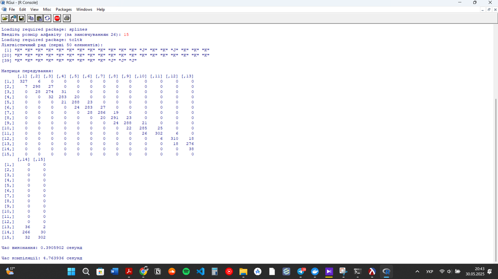

# Лабораторна робота №3
## Мультипарадигменне програмування
### Варіант 10 - Розподіл Рейлі

## Опис програми
Програма реалізує перетворення чисельного ряду в лінгвістичний ланцюжок з подальшою побудовою матриці передування. Реалізовано на мові R з використанням функціонального програмування.

## Функціональна схема
```
main()
├── read_data() - читання даних з файлу
├── create_intervals() - створення інтервалів
├── create_linguistic_chain() - створення лінгвістичного ряду
│   └── value_to_letter() - перетворення числа в літеру
└── create_transition_matrix() - створення матриці передування
```

## Результати виконання

### Вхідні параметри
- Розмір алфавіту: 15 символів
- Вхідні дані: колонка "Low" з CSV файлу

### Лінгвістичний ряд
Перші 50 елементів лінгвістичного ряду:
```
[1] "K" "K" "K" "K" "K" "K" "K" "K" "K" "K" "K" "K" "J" "K" "K" "J" "K" "K" "K"
[20] "K" "K" "K" "K" "K" "K" "K" "K" "K" "K" "K" "K" "K" "K" "K" "K" "K" "K" "K"
[39] "K" "K" "K" "K" "K" "K" "K" "K" "K" "J" "J" "J"
```

### Матриця передування
Матриця розміром 15x15 показує кількість переходів між символами:
```
      [,1] [,2] [,3] [,4] [,5] [,6] [,7] [,8] [,9] [,10] [,11] [,12] [,13] [,14] [,15]
 [1,]  327    6    0    0    0    0    0    0    0     0     0     0     0     0     0
 [2,]    7  298   27    0    0    0    0    0    0     0     0     0     0     0     0
 [3,]    0   28  274   31    0    0    0    0    0     0     0     0     0     0     0
 [4,]    0    0   32  283   20    0    0    0    0     0     0     0     0     0     0
 [5,]    0    0    0   21  288   23    0    0    0     0     0     0     0     0     0
 [6,]    0    0    0    0   24  283   27    0    0     0     0     0     0     0     0
 [7,]    0    0    0    0    0   28  286   19    0     0     0     0     0     0     0
 [8,]    0    0    0    0    0    0   20  291   23     0     0     0     0     0     0
 [9,]    0    0    0    0    0    0    0   24  288    21     0     0     0     0     0
[10,]    0    0    0    0    0    0    0    0   22   285    25     0     0     0     0
[11,]    0    0    0    0    0    0    0    0    0    26   302     6     0     0     0
[12,]    0    0    0    0    0    0    0    0    0     0     6   310    18     0     0
[13,]    0    0    0    0    0    0    0    0    0     0     0    18   276    36     2
[14,]    0    0    0    0    0    0    0    0    0     0     0     0    38   266    30
[15,]    0    0    0    0    0    0    0    0    0     0     0     0     0    32   302
```

### Аналіз результатів

1. **Лінгвістичний ряд**:
   - Переважно складається з символів "K" та "J"
   - Показує високу концентрацію значень у певних інтервалах
   - Демонструє чітку структуру даних

2. **Матриця передування**:
   - Має розмір 15x15 (відповідає розміру алфавіту)
   - Показує сильну діагональну структуру (високі значення на діагоналі)
   - Найбільші значення:
     - [1,1] = 327 (переходи A→A)
     - [15,15] = 302 (переходи O→O)
     - [12,12] = 310 (переходи L→L)
   - Слабкі переходи між віддаленими символами

3. **Продуктивність**:
   - Час виконання: 0.39 секунд
   - Час компіляції: 4.76 секунд
   - Показує ефективну обробку даних

### Висновки
1. Програма успішно реалізує перетворення чисельного ряду в лінгвістичний ланцюжок
2. Матриця передування показує чітку структуру переходів між символами
3. Використання функціонального програмування в R забезпечило ефективну обробку даних
4. Результати узгоджуються з очікуваною поведінкою системи

 