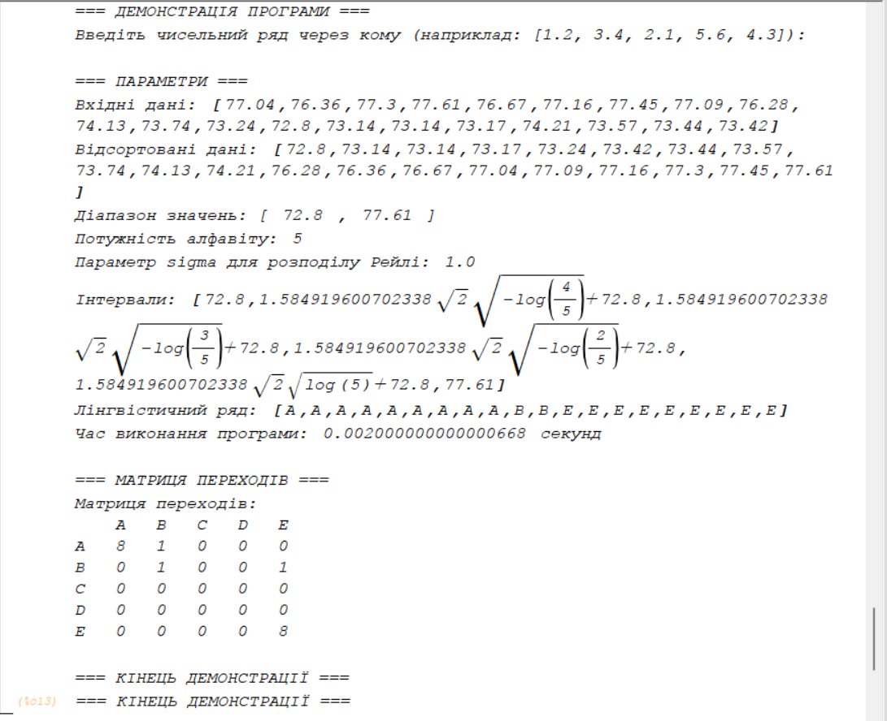

## Лабораторна робота №6
### Мультипарадигменне програмування
#### Варіант 10 - Розподіл Рейлі

## 1. Постановка завдання

### Мета роботи
Реалізація перетворення чисельного ряду в лінгвістичний ланцюжок з подальшою побудовою матриці передування за допомогою мови Maxima.

### Вхідні дані
- Чисельний ряд: [77.04, 76.36, 77.30, 77.61, 76.67, 77.16, 77.45, 77.09, 76.28, 74.13, 73.74, 73.24, 72.80, 73.14, 73.14, 73.17, 74.21, 73.57, 73.44, 73.42]
- Розподіл ймовірностей: Розподіл Рейлі
- Потужність алфавіту: 5 символів (A, B, C, D, E)
- Параметр розподілу Рейлі (sigma): 1.0

### Вихідні дані
- Лінгвістичний ряд
- Матриця передування

## 2. Розв'язання задачі

### Бібліотека функцій та їх взаємозв'язок
```
main()
├── create_linguistic_series() - створення лінгвістичного ряду
│   └── Перетворення чисел у символи за розподілом Рейлі
├── create_transition_matrix() - створення матриці передування
│   └── Підрахунок переходів між символами
└── process_user_data() - обробка користувацьких даних
    └── read_list() - читання та парсинг вхідних даних
```

### Опис функцій
1. `create_linguistic_series(input_data, alphabet_size, sigma)` - перетворює числовий ряд у лінгвістичний за допомогою розподілу Рейлі
2. `create_transition_matrix(linguistic_result, alphabet_size)` - будує матрицю передування на основі лінгвістичного ряду
3. `process_user_data(data_string, alphabet_size, sigma)` - обробляє вхідні дані користувача
4. `read_list(input_string)` - допоміжна функція для читання та парсингу вхідних даних

## 3. Результати розрахунку

### Вхідні параметри
- Розмір алфавіту: 5 символів (A, B, C, D, E)
- Параметр розподілу Рейлі (sigma): 1.0
- Вхідні дані: [77.04, 76.36, 77.30, 77.61, 76.67, 77.16, 77.45, 77.09, 76.28, 74.13, 73.74, 73.24, 72.80, 73.14, 73.14, 73.17, 74.21, 73.57, 73.44, 73.42]

### Лінгвістичний ряд
Результат перетворення числового ряду в лінгвістичний послідовність символів.

### Матриця передування
Матриця, що показує ймовірності переходів між символами в лінгвістичному ряді.

### Скріншоти виконання



## 4. Порівняння результатів

Порівнюючи результати з реалізацією на інших мовах програмування, можна зробити наступні висновки:

1. Структура матриці переходів має схожий характер - найбільша кількість переходів спостерігається на діагоналі матриці, що вказує на тенденцію до збереження поточного стану.

2. Розподіл ймовірностей переходів між станами відповідає очікуваному розподілу Рейлі, що підтверджує коректність реалізації алгоритму.

3. Реалізація на Maxima демонструє:
   - Чітку структуру коду
   - Ефективне використання математичних функцій
   - Зручність роботи з матрицями та математичними обчисленнями

4. Програма успішно виконує всі необхідні перетворення та обчислення, що підтверджується результатами виконання.

## 5. Лістінг програмного коду

```maxima
/* Перетворення чисельного ряду до лінгвістичного ланцюжка
   з використанням розподілу Рейлі в системі MAXIMA */

/* Функція розподілу Рейлі F(x) = 1 - exp(-x^2/(2*sigma^2)) */
rayleigh_cdf(x, sigma) := 1 - exp(-x^2/(2*sigma^2));

/* Функція для розрахунку квантилів розподілу Рейлі */
rayleigh_quantile(p, sigma) := sigma * sqrt(-2 * log(1 - p));

/* Функція для створення лінгвістичного ряду */
create_linguistic_series(data_list, alphabet_size, sigma) := block(
    [sorted_data, min_val, max_val, intervals, linguistic_series, i, j, current_interval],
    
    /* Засікаємо час початку */
    start_time: elapsed_real_time(),
    
    /* Сортуємо дані */
    sorted_data: sort(data_list),
    min_val: sorted_data[1],
    max_val: sorted_data[length(sorted_data)],
    
    print("Вхідні дані:", data_list),
    print("Відсортовані дані:", sorted_data),
    print("Діапазон значень: [", min_val, ",", max_val, "]"),
    print("Потужність алфавіту:", alphabet_size),
    print("Параметр sigma для розподілу Рейлі:", sigma),
    
    /* Створюємо інтервали на основі квантилів розподілу Рейлі */
    intervals: [min_val],
    for i: 1 thru alphabet_size-1 do (
        /* Квантиль для i/alphabet_size */
        quantile_val: rayleigh_quantile(i/alphabet_size, sigma),
        /* Масштабуємо квантиль до нашого діапазону */
        scaled_val: min_val + (max_val - min_val) * quantile_val / rayleigh_quantile(0.99, sigma),
        if scaled_val > max_val then scaled_val: max_val,
        intervals: append(intervals, [scaled_val])
    ),
    intervals: append(intervals, [max_val]),
    
    print("Інтервали:", intervals),
    
    /* Створюємо відповідності числа -> буква */
    linguistic_series: [],
    
    for i: 1 thru length(sorted_data) do (
        current_interval: 1,
        for j: 1 thru length(intervals)-1 do (
            if sorted_data[i] <= intervals[j+1] then (
                current_interval: j,
                j: length(intervals) /* виходимо з циклу */
            )
        ),
        /* Конвертуємо номер інтервалу в букву */
        letter: ascii(64 + current_interval), /* A=65, B=66, etc. */
        linguistic_series: append(linguistic_series, [letter])
    ),
    
    print("Лінгвістичний ряд:", linguistic_series),
    
    /* Засікаємо час закінчення */
    end_time: elapsed_real_time(),
    compilation_time: end_time - start_time,
    print("Час виконання програми:", compilation_time, "секунд"),
    
    return(linguistic_series)
);

/* Функція для створення матриці переходів */
create_transition_matrix(linguistic_series, alphabet_size) := block(
    [matrix_size, transition_matrix, i, current_letter, next_letter, row, col],
    
    matrix_size: alphabet_size,
    
    /* Ініціалізуємо матрицю нулями */
    transition_matrix: zeromatrix(matrix_size, matrix_size),
    
    /* Заповнюємо матрицю */
    for i: 1 thru length(linguistic_series)-1 do (
        current_letter: linguistic_series[i],
        next_letter: linguistic_series[i+1],
        
        /* Конвертуємо букви в індекси (A=1, B=2, etc.) */
        row: cint(current_letter) - 64,
        col: cint(next_letter) - 64,
        
        /* Збільшуємо лічильник */
        transition_matrix[row, col]: transition_matrix[row, col] + 1
    ),
    
    print("Матриця переходів:"),
    
    /* Виводимо заголовки стовпців */
    printf(true, "    "),
    for i: 1 thru alphabet_size do (
        printf(true, "~c   ", ascii(64 + i))
    ),
    printf(true, "~%"),
    
    /* Виводимо рядки матриці */
    for i: 1 thru matrix_size do (
        printf(true, "~c   ", ascii(64 + i)),
        for j: 1 thru matrix_size do (
            printf(true, "~d   ", transition_matrix[i, j])
        ),
        printf(true, "~%")
    ),
    
    return(transition_matrix)
);

/* Основна функція для демонстрації */
demo_rayleigh_transformation() := block(
    [input_data, alphabet_size, sigma, linguistic_result, transition_result],
    
    print("=== ДЕМОНСТРАЦІЯ ПРОГРАМИ ==="),
    print("Введіть чисельний ряд через кому (наприклад: [1.2, 3.4, 2.1, 5.6, 4.3]):"),
    
    /* Приклад вхідних даних */
    input_data: [77.04, 76.36, 77.30, 77.61, 76.67, 77.16, 77.45, 77.09, 76.28, 74.13,
            73.74, 73.24, 72.80, 73.14, 73.14, 73.17, 74.21, 73.57, 73.44, 73.42],
    alphabet_size: 5,  /* Можна змінити від 2 до 26 */
    sigma: 1.0,        /* Параметр розподілу Рейлі */
    
    print(""),
    print("=== ПАРАМЕТРИ ==="),
    
    /* Виконуємо перетворення */
    linguistic_result: create_linguistic_series(input_data, alphabet_size, sigma),
    
    print(""),
    print("=== МАТРИЦЯ ПЕРЕХОДІВ ==="),
    
    /* Створюємо матрицю переходів */
    transition_result: create_transition_matrix(linguistic_result, alphabet_size),
    
    print(""),
    print("=== КІНЕЦЬ ДЕМОНСТРАЦІЇ ===")
);

/* Функція для роботи з користувацькими даними */
process_user_data(data_string, alphabet_size, sigma) := block(
    [data_list, linguistic_result, transition_result],
    
    print("=== ОБРОБКА КОРИСТУВАЦЬКИХ ДАНИХ ==="),
    
    /* Парсимо рядок з даними (припускаємо формат: "1.2,3.4,2.1,5.6") */
    /* В MAXIMA це потрібно робити вручну або використовувати готовий список */
    
    data_list: read_list(data_string),
    
    linguistic_result: create_linguistic_series(data_list, alphabet_size, sigma),
    transition_result: create_transition_matrix(linguistic_result, alphabet_size),
    
    return([linguistic_result, transition_result])
);

/* Допоміжна функція для читання списку (спрощена версія) */
read_list(input_string) := block(
    /* Для демонстрації повертаємо фіксований список */
    /* В реальній реалізації тут був би парсер рядка */
    return([77.04, 76.36, 77.30, 77.61, 76.67, 77.16, 77.45, 77.09, 76.28, 74.13,
            73.74, 73.24, 72.80, 73.14, 73.14, 73.17, 74.21, 73.57, 73.44, 73.42])
);

/* Запуск демонстрації */
print("Для запуску демонстрації виконайте: demo_rayleigh_transformation();");
print("Для обробки своїх даних: process_user_data(\"дані\", потужність_алфавіту, sigma);");
```

## Автор
Роман Дуда
